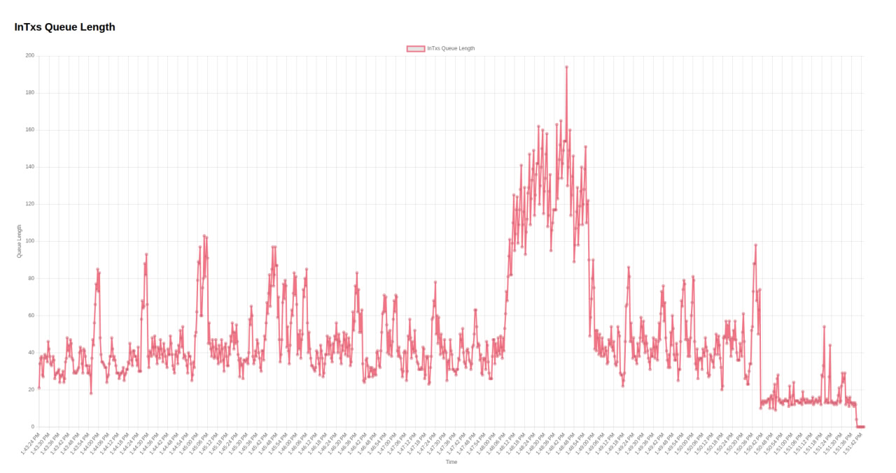

# Load Test

A tool for testing transaction performance.

## Overview

This load testing framework is designed to simulate high-volume transaction scenarios to evaluate the performance of
blockchain infrastructure components including Bitcoin nodes, Ethereum clients, and associated services.

## Prerequisites for Local Testing

Before running the load tests, ensure the following services are running:

1. **Bitcoin Core (bitcoind)** - Bitcoin node with RPC enabled
2. **Auto-miner** - Automated block mining for test environment
3. **Runehook + Runehook API** - Runes protocol indexer and API service
4. **UTXO Service** - Service handling the `/utxos/:address` endpoint (currently deployed as separate microservice)
5. **Mempool** - Bitcoin mempool tracker and API
6. **Geth + BTC Observer** - Ethereum client with Bitcoin network observer

## Configuration

The environment is configured for `localhost` by default. To modify the configuration for different environments, update
the settings in [`./src/config.ts`](./src/config.ts).

## Real-time Queue Monitoring

The BTC Observer includes an HTTP listener with a monitoring endpoint at `http://localhost:8888/graphs` where you can
view real-time transaction queue metrics.

### Example Results

Below is an example of processing 10,000 transactions at 20 TPS:

- **X-axis**: Time
- **Y-axis**: Number of transactions in queue

